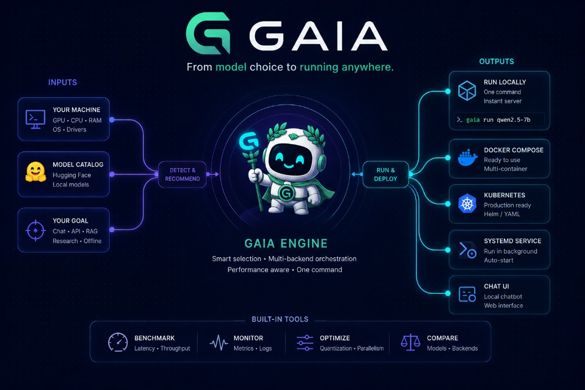
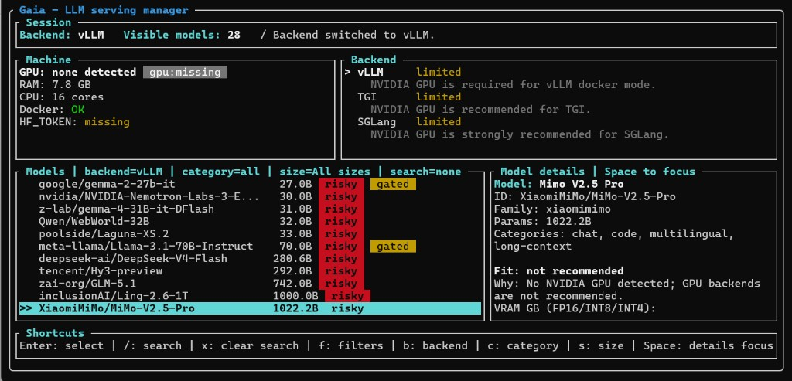

<h1 align="center">Gaia</h1>

<p align="center">
  
</p>

<p align="center">
  
  
  
  
  
  
</p>

`gaia` is a terminal-first toolkit to deploy Hugging Face LLMs with a practical CLI/TUI workflow.

It is designed to stay focused on runtime orchestration:

- detect host capabilities (`doctor`)
- explore models from a local catalog (`models`, `recommend`)
- launch inference backends (`serve`, `select`)
- generate deployment artifacts (`generate-compose`, `generate-k8s`, `generate-systemd`)
- scaffold and run a local chatbot UI (`init-chatbot`)
- validate endpoint latency (`benchmark`)

## Documentation

Full documentation lives in `docs/`:

- `docs/README.md`
- `docs/getting-started.md`
- `docs/command-reference.md`
- `docs/architecture.md`
- `docs/chatbot-agent-from-scratch.md`
- `docs/openai-compatibility.md`
- `docs/deployment-patterns.md`
- `docs/model-catalog.md`
- `docs/troubleshooting.md`

## Project Policies

- `CONTRIBUTING.md`
- `SECURITY.md`
- `CODE_OF_CONDUCT.md`
- `LICENSE`

## Key Features

- Rust workspace (`gaia-core`, `gaia-cli`, `gaia-tui`)
- machine detection using `sysinfo`, Docker probes, and `nvidia-smi`
- local model catalog in `catalog/models.yaml`
- recommendation engine with fit statuses (`easy`, `fits`, `tight`, `requires quantization`, etc.)
- backend abstraction and command generation with pinned image digests for:
  - vLLM (`vllm/vllm-openai@sha256:...`)
  - TGI (`ghcr.io/huggingface/text-generation-inference@sha256:...`)
  - SGLang (`lmsysorg/sglang@sha256:...`)
  - llama.cpp (`ghcr.io/ggml-org/llama.cpp@sha256:...`)
  - Ollama (`ollama/ollama@sha256:...`)
- quantization profiles (`none`, `quality`, `balanced`, `memory`, `speed`)
- model pinning by immutable commit SHA (`--model-revision`)
- mock OpenAI API mode with `chat/completions`, `completions`, `responses`, `embeddings`, and audio endpoints (`--mock`)
- deterministic chatbot dependencies via lockfile + `npm ci`

## Install From Source

Requirements:

- Rust toolchain
- Docker
- NVIDIA drivers + NVIDIA Container Toolkit (recommended for GPU backends)

Build:

```bash
cargo build --release -p gaia-cli
```

Run directly:

```bash
./target/release/gaia --help
```

Optional install helper:

```bash
./install.sh
```

By default, `install.sh` installs into `~/.local/bin`.

## Quickstart Local (2 commands)

```bash
gaia doctor
gaia serve --mock --detach --host 0.0.0.0 --port 8000
```

Notes:

- local mode stays simple (`security-profile=dev` by default)
- a strong API key is auto-generated if needed and stored in your local config
- `HF_TOKEN` is only required for gated models

## Production Secure Checklist (5 commands)

```bash
export GAIA_SECURITY_PROFILE=prod
export GAIA_API_KEY="replace-with-strong-random-key"
export HF_TOKEN="hf_xxx_if_model_is_gated"
gaia doctor
gaia serve --security-profile prod --backend vllm --model Qwen/Qwen2.5-7B-Instruct --model-revision 0123456789abcdef0123456789abcdef01234567 --port 8000 --detach
```

In `prod` profile:

- API key fallback is disabled (explicit secret required)
- missing `HF_TOKEN` is blocked only for gated models

## Guided Interactive Flow

Use the TUI wizard:

```bash
gaia select
```

Example `gaia select` screen:



Launch a real backend (example):

```bash
gaia serve \
  --backend vllm \
  --model Qwen/Qwen2.5-7B-Instruct \
  --model-revision 0123456789abcdef0123456789abcdef01234567 \
  --port 8000 \
  --detach
```

## Command Overview

- `gaia doctor`
- `gaia models`
- `gaia recommend`
- `gaia select`
- `gaia serve`
- `gaia stop`
- `gaia status`
- `gaia logs`
- `gaia generate-compose`
- `gaia generate-k8s`
- `gaia generate-systemd`
- `gaia benchmark`
- `gaia init-chatbot`
- `gaia open-chatbot`

See `docs/command-reference.md` for complete options and examples.

## Interactive TUI Highlights (`gaia select`)

Core shortcuts:

- `Up/Down`: navigate model list
- `Enter`: continue setup
- `/`: search
- `x`: clear active search
- `f` or `c`: category filter
- `s`: size filter
- `b`: switch backend
- `Space`: focus model details panel (scroll details and inspect full HF URL in footer)
- `q`: quit


## Model Catalog Prefill (Hugging Face API)

Use:

```bash
python3 hf_catalog_prefill.py --output catalog/models.generated.yaml
```

Then review and promote:

```bash
cp catalog/models.generated.yaml catalog/models.yaml
```

See `docs/model-catalog.md` for full options.

## Project Layout

```text
gaia/
  catalog/
  crates/
    gaia-core/
    gaia-cli/
    gaia-tui/
  docs/
  templates/chatbot-react/
  examples/
```

## License

MIT
